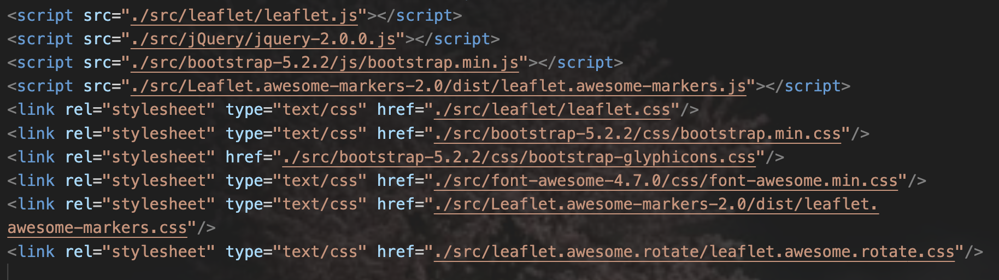

# 使用说明
这是一个绘制路径图的项目
## 快速开始
```bash
bash run.sh
```
### run.sh参数介绍
- RAW_LOCATION_DIR代表存储要绘制的路径文件的文件夹，一个文件代表一条路线，参考可以看raw_location里面的文件，一个文件表示一条要绘制的路径。
- JINGWEIDU_LOCATION_DIR代表存储RAW_LOCATION_DIR每个文件的地点加经纬度的文件的文件夹，参考可以看jingweidu_location里面的文件，一个文件表示一条要绘制的路径。
- HTML_FILE_NAME代表要保存的路径图的文件名，后缀是.html
- MAP_TYPE代表需要绘制的地图的类型，地图类型有街道图，路网图和卫星图，只支持2D绘制，3D绘制的不支持。

## 环境
envirionment.yml

## 项目结构
### .env
.env文件中是项目的配置文件，AMAP_KEY表示高德api,申请网址https://console.amap.com/dev/key/app
，AMAP_URL表示高德地图的URL。
### src
src文件是离线的js文件包。

请注意不同的folium版本使用的js包的版本不一样，如果遇到html文件中有离线的js，会影响网页打开速度，这时就需要在replaceJS中进行相应的替换。

例如

就需要将这些替换为本地的js，在replaceJS中的Contents进行替换，一般同一个folium库使用的js版本是一样的。
```python
Contents = [['''<script src="https://code.jquery.com/jquery-1.12.4.min.js"></script>''',
                        '''<script src="./src/jQuery/jquery-2.0.0.js"></script>'''],
                       ['''<script src="https://code.jquery.com/jquery-3.7.1.min.js"></script>''',
                        '''<script src="./src/jQuery/jquery-2.0.0.js"></script>'''],
                       ['''<script src="https://cdn.jsdelivr.net/npm/leaflet@1.9.3/dist/leaflet.js"></script>''',
                        '''<script src="./src/leaflet/leaflet.js"></script>'''],
                       ['''<script src="https://cdn.jsdelivr.net/npm/bootstrap@5.2.2/dist/js/bootstrap.bundle.min.js"></script>''',
                        '''<script src="./src/bootstrap-5.2.2/js/bootstrap.min.js"></script>'''],
                       ['''<script src="https://cdnjs.cloudflare.com/ajax/libs/Leaflet.awesome-markers/2.0.2/leaflet.awesome-markers.js"></script>''',
                        '''<script src="./src/Leaflet.awesome-markers-2.0/dist/leaflet.awesome-markers.js"></script>'''],
                       ['''<link rel="stylesheet" href="https://cdn.jsdelivr.net/npm/leaflet@1.9.3/dist/leaflet.css"/>''',
                        '''<link rel="stylesheet" type="text/css" href="./src/leaflet/leaflet.css"/>'''],
                       ['''<link rel="stylesheet" href="https://cdn.jsdelivr.net/npm/bootstrap@5.2.2/dist/css/bootstrap.min.css"/>''',
                        '''<link rel="stylesheet" type="text/css" href="./src/bootstrap-5.2.2/css/bootstrap.min.css"/>'''],
                       ['''<link rel="stylesheet" href="https://netdna.bootstrapcdn.com/bootstrap/3.0.0/css/bootstrap.min.css"/>''',
                        '''<link rel="stylesheet" type="text/css" href="./src/bootstrap-5.2.2/css/bootstrap-theme.min.css"/>'''],
                       ['''<link rel="stylesheet" href="https://cdn.jsdelivr.net/npm/@fortawesome/fontawesome-free@6.2.0/css/all.min.css"/>''',
                        '''<link rel="stylesheet" type="text/css" href="./src/font-awesome-4.7.0/css/font-awesome.min.css"/>'''],
                       ['''<link rel="stylesheet" href="https://cdnjs.cloudflare.com/ajax/libs/Leaflet.awesome-markers/2.0.2/leaflet.awesome-markers.css"/>''',
                        '''<link rel="stylesheet" type="text/css" href="./src/Leaflet.awesome-markers-2.0/dist/leaflet.awesome-markers.css"/>'''],
                       ['''<link rel="stylesheet" href="https://cdn.jsdelivr.net/gh/python-visualization/folium/folium/templates/leaflet.awesome.rotate.min.css"/>''',
                        '''<link rel="stylesheet" type="text/css" href="./src/leaflet.awesome.rotate/leaflet.awesome.rotate.css"/>'''],
                       ['''<script src="https://cdnjs.cloudflare.com/ajax/libs/leaflet.markercluster/1.1.0/leaflet.markercluster.js"></script>''',
                        '''<script src="./src/leaflet.markercluster/dist/leaflet.markercluster.js"></script>'''],
                       ['''<link rel="stylesheet" href="https://cdnjs.cloudflare.com/ajax/libs/leaflet.markercluster/1.1.0/MarkerCluster.css"/>''',
                        '''<link rel="stylesheet" type="text/css" href="./src/leaflet.markercluster/dist/MarkerCluster.css"/>'''],
                       ['''<link rel="stylesheet" href="https://cdnjs.cloudflare.com/ajax/libs/leaflet.markercluster/1.1.0/MarkerCluster.Default.css"/>''',
                        '''<link rel="stylesheet" type="text/css" href="./src/leaflet.markercluster/dist/MarkerCluster.Default.css"/>'''],
                       ['''<script src="https://cdnjs.cloudflare.com/ajax/libs/leaflet-dvf/0.3.0/leaflet-dvf.markers.min.js"></script>''',
                        '''<script src="./src/leaflet-dvf/leaflet-dvf.markers.min.js"></script>'''],
                        ['''<link rel="stylesheet" href="https://netdna.bootstrapcdn.com/bootstrap/3.0.0/css/bootstrap-glyphicons.css"/>''',
                         '''<link rel="stylesheet" href="./src/bootstrap-5.2.2/css/bootstrap-glyphicons.css"/>''']
```
## location_search.py
进行地点的经纬度查找
## road_map.py
绘制路线图


